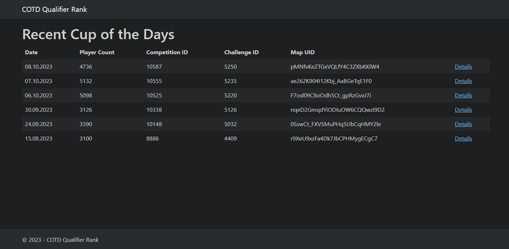
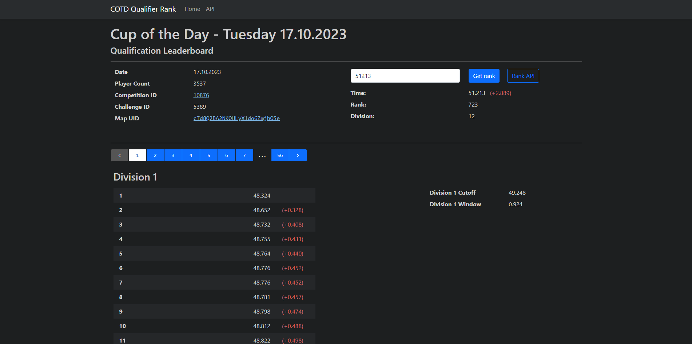

# Cup of the Day Qualifier Rank<br>Website and API
[](https://dotnet.microsoft.com/en-us/download/dotnet/8.0)
[](https://www.gnu.org/licenses/gpl-3.0)

Cup of the Day Qualifier Rank is a website and API for finding the seeding 
of your current PB in an arbitrary COTD qualifying session. It provides a 
Web UI for browsing information and leaderboards from previous COTD qualifying
sessions, as well as an API for fetching this data in a structured manner. 

__Note:__ _This project is still a work in progress and is therefore not
publicly available or integrated with an accompanying
[Openplanet Plugin](https://github.com/haakon8855/COTD-qualifier-rank)._

## Overview

- [Cup of the Day Qualifier RankWebsite and API](#cup-of-the-day-qualifier-rankwebsite-and-api)
  - [Overview](#overview)
  - [Introduction](#introduction)
    - [The Decentralised Approach](#the-decentralised-approach)
    - [The Centralised Approach](#the-centralised-approach)
    - [Solution](#solution)
  - [API Documentation](#api-documentation)
    - [Rank](#rank)
    - [Maps](#maps)
    - [Competitions](#competitions)
    - [Qualifying Leaderboard](#qualifying-leaderboard)
  - [Website](#website)
  - [Setup Guide](#setup-guide)
    - [Prerequisites](#prerequisites)
    - [Install .NET](#install-net)
    - [Download Source Code](#download-source-code)
    - [Create a Trackmania Dedicated Server Account](#create-a-trackmania-dedicated-server-account)
    - [Provide Credentials for the Server](#provide-credentials-for-the-server)
    - [Create the Database](#create-the-database)
    - [Run the Server](#run-the-server)
  - [License](#license)
  - [Credits](#credits)

## Introduction

Have you ever been playing an old Track of the Day and wondered
which division you would have gotten with your current PB on that map?

This problem can be solved in a couple ways, but ultimately, someone needs to 
fetch COTD data from the Trackmania Web Services API provided by Nadeo.

### The Decentralised Approach
An OpenPlanet plugin can be created that runs the required requests client-side
within Trackmania 2020. This solution does not rely on a centralised server and
fetches all required data directly from Nadeo.
However, there are several problems with this solution:

- Leaderboard data needs to be fetched every time a TOTD map is loaded. Even
  if caching is implemented, this creates on average 10-20 requests to Nadeo
  every time an uncached map is loaded. Keeping a cache also needs to be stored
  on disk for each user, and is not synced across computers and is lost if the
  plugin is uninstalled.
- Obtaining the ID of a qualification leaderboard given a MapId is very
  difficult when only relying on Nadeo's own API and can generate a lot of
  requests. Wihtout caching, this can create between 1 and 100 requests to
  Nadeo (__each time a map is loaded by the user__) depending on when the track
  was TOTD. (newer TOTDs require less requests)
- Fetched data cannot be shared between users, and thus each user has to fetch
  the same leaderboard data and IDs for each map loaded.

### The Centralised Approach

Another approach to this problem is to create a centralised server handling
all communication with Nadeo's API. This way, both qualification 
leaderboard IDs and leaderboard data can be cached in one server database.
Additionally, since historical TOTD data never changes after qualification
commences, caching only needs to happen once per map.

An accompanying OpenPlanet plugin can then be created. This plugin would only
need to send requests to this centralised API. The server can return the
player's "rank" when prompted with a MapUID and the player's PB. Both of which
are trivial to retrieve from an OpenPlaned plugin.

The main downside to this approach is the work and costs tied to maintaining
and running a server.

### Solution

The server in this repo utilises the centralised approach.
The main use case of this API is to show users what their seeding would have
been if they drove their current PB during the COTD qualifying session for
that TOTD. This API tries to provide this functionality in an efficient manner
without contacting Nadeo's own API for every request.

When the rank from a specific qualifying session is requested, the server 
searches its database for the corresponding leaderboard in order to provide
the requested rank. If this data is not yet stored in the server's database, 
it fetches the necessary data from Nadeo and stores it for future requests. 
Due to this implementation, the first request for any COTD qualifying session
will return a 503 response and promt the client to retry after a few seconds.
This is intended behaviour as this initial request prompts the server to start
fetching the data from Nadeo. All subsequent requests for the same qualifying
session will fetch data directly from the server's database, and will return
the requested data immediately.

__Note:__ _Only the [Rank endpoint](#rank) will fetch leaderboard data from
Nadeo when data is not cached. If data has not been cached for other endpoints,
a 404 response code is returned._

The API is made to accompany the 
openplanet plugin 
[COTD Qualifier Rank](https://github.com/haakon8855/COTD-qualifier-rank)
for Trackmania 2020. 

## API Documentation

__Note:__ _Swagger documentation is available when running the server locally
at `http:localhost:5000/Swagger`_

The API contains several endpoints serving data related to COTDs (competitions)
and COTD leaderboards (challenges). These include endpoints for competition
metadata, TOTD MapUids, qualifier rank and qualifier leaderboards.

The Rank endpoint is considered the main use-case of this API, providing the
rank for a given time on a specied TOTD as if that time was driven during the 
COTD 15-minute qualifying session. This endpoint is made to accompany the
[COTD Qualifier Rank](https://github.com/haakon8855/COTD-qualifier-rank)
plugin (WIP). 

The following is a list of the available endpoints and details about them.

### Rank
- **URL**: `/api/rank/{mapUid}/{time}`
- **Method**: GET
- **Description**: Returns the seeding/rank of the given time
  on the given MapUID  
  - If the requested leaderboard has not previously been fetched from Nadeo,
    the server responds with response code 503 and promts the client to retry
    after a few seconds. This happens because fetching of a leaderboard from 
    Nadeo usually takes about 30 seconds.
- **Values**:
  - `mapUid (str)`: The UID of any TOTD. If the associated COTD competition's
    data has not yet been fetched from Nadeo by the server, no data is returned.
  - `time (int)`: The time in milliseconds for which a rank is returned
    (e.g. your current PB on the track).

**Example Request**:

```shell
curl -X GET http://localhost:5000/api/rank/ae262K904I12Kbj_AaBGeTqE1F0/49302
```

 **Response**:

```json
{
    "mapUid": "ae262K904I12Kbj_AaBGeTqE1F0",
    "competitionId": 10555,
    "challengeId": 5235,
    "date": "2023-10-07T19:00:00",
    "time": 49302,
    "rank": 4079
}
```

### Maps
- **URL**: `/api/maps`
- **Method**: GET
- **Description**: Returns a list of MapUids for all COTD leaderboards that are
  currently in the server's database, sorted by COTD date.
  New TOTDs are not automatically added to the server's database and are
  fetched from Nadeo on a JIT basis. I.e. competition and map data is only
  fetched from Nadeo when that data is needed. When qualifying session from a
  COTD is fetched from Nadeo, the track's MapUid is added to the database and
  will then be returned as part of this list.  

**Example Request**:

```shell
curl -X GET http://localhost:5000/api/maps
```

 **Response**:

```json
[
    "5G1WTldWDF810zEiS5dxiS2DtMj",
    "1pmNdxhn5SrE82rh4EafPIxg7y7",
    "IWCPdbCtlaYUWCVfWxDads9dsc",
    ...
    "JQkYS9BcGzbl67hu5PBdyIDcWUl",
    "JRaHDJ_ZfSbFfGxrVw9Uk9Ai3i9"
]
```

### Competitions
- **URL**: `/api/competitions/{mapUid|competitionId}`
- **Method**: GET
- **Description**: Returns information about a COTD given its CompetitionId or
  the MapUid of its associated track.
- **Values**:
  - `mapUid (str)`: The UID of any TOTD. If the associated COTD competition's
    data has not yet been fetched from Nadeo by the server, no data is returned.
  - `competitionId (int)`: The ID of any COTD. If the COTD competition data has not
    yet been fetched from Nadeo by the server, no data is returned.

**Example Request**:

```shell
curl -X GET http://localhost:5000/api/competitions/rbzxGFuf_dKyzxir8RgzvX5Ss65
```
or
```shell
curl -X GET http://localhost:5000/api/competitions/9447
```

 **Response**:

```json
{
    "competitionId": 9447,
    "challengeId": 4689,
    "mapUid": "rbzxGFuf_dKyzxir8RgzvX5Ss65",
    "date": "2023-09-02T19:00:00"
}
```

### Qualifying Leaderboard
- **URL**: `/api/competitions/{mapUid|competitionId}/leaderboard`
- **Method**: GET
- **Description**: Returns the leaderboard from the qualifying session in a
  COTD given the cup's CompetitionId or the associated track's MapUid.  
  A normal COTD normally has somewhere between 1000 and 5000 players, usually
  depending on how recent it was. E.g. COTDs from 2020 saw around 1.5k players
  while COTDs after console release regularly contain upwards of 3k players.
  Expect the size of the returned list to in this range.
- **Values**:
  - `mapUid (str)`: The UID of any TOTD. If the associated COTD competition's
    data has not yet been fetched from Nadeo by the server, no data is returned.
  - `competitionId (int)`: The ID of any COTD. If the COTD competition data has
    not yet been fetched from Nadeo by the server, no data is returned.

**Example Requests**:

```shell
curl -X GET http://localhost:5000/api/competitions/rbzxGFuf_dKyzxir8RgzvX5Ss65/leaderboard
```
or
```shell
curl -X GET http://localhost:5000/api/competitions/9447/leaderboard
```

 **Response**:

```json
[
    44370,
    44440,
    44497,
    ...
    197554,
    206797,
    247544
]
```

## Website

The website provided by the server is not strictly necessary and only meant to
supplement the API with a more readable graphical user interface showing
details and data from each qualification leaderboard.

The home page on the website shows a list of the most recent Cup of the Days:



<br>Clicking on _Details_ for a specific COTD redirects to a more detailed
view of the qualification leaderboard for that COTD. This page includes a full
paginated qualification leaderboard, COTD metadata and links to the
corresponding TOTD and COTD on [trackmania.io](trackmania.io). It is also
possible to manually fetch your rank by entering it in the input on the upper
right of this page.



## Setup Guide

The following section will guide you through the necessary steps to run this
server locally.

### Prerequisites

To successfully run this server locally, you will need the following:
- An active Trackmania Club Access Subscription
- .NET 8.0

### Install .NET

Make sure you have
[.NET 8.0](https://dotnet.microsoft.com/en-us/download/dotnet/8.0)
installed.

To verify you have the correct version, run the following command in the
terminal:

```shell
dotnet --version
```

This should return `8.0.x`

### Download Source Code

Clone the repo:

```shell
git clone https://github.com/haakon8855/COTD-qualifier-rank-web.git
```

Or download the source code as a `.zip`.

### Create a Trackmania Dedicated Server Account

In order to authenticate with the Trackmania Web Services API, we need to
provide our server with credentials with the necessary authorisation.

To create a dedicated server account, go to
<https://www.trackmania.com/player/dedicated-servers>
and create a dedicated server account by entering a server login
of your choosing.  
_Note: This requires you to login with a Ubisoft account_
with an active Trackmania Club Access subsciption

Take note of your server login, as well as the generated
`password` and `account-id`.

### Provide Credentials for the Server

Create a file in `CotdQualifierRankWeb/` named `credentials.json`
```shell
touch CotdQualifierRankWeb/credentials.json
```
and store your dedicated server account credentials inside
with the following format:
```json
{
    "Login": "<dedicated-server-account-login>",
    "Password": "<dedicated-server-account-password>",
    "AccountId": "<dedicated-server-account-account-id>",
    "UserAgent": "<your-user-agent>",
}
```
You'll also need to provide a User-Agent in the credentials file,
which is usually on the following format:
```
Application Name / your-email-address@example.com
```

### Create the Database

To create the database run the following commands:
```shell
cd CotdQualifierRankWeb/
dotnet ef database update
```

### Run the Server

Open a terminal inside the repo and run the following commands:
```shell
cd CotdQualifierRankWeb/
dotnet run
```

## License
The code in this repository is protected by the
[GNU General Public License v3](./LICENSE).

## Credits

This project would not be possible without:
- The Openplanet team's
  [Trackmania Web Services API Documentation](https://webservices.openplanet.dev/)
- Numerous helpful individuals from the Openplanet discord server
